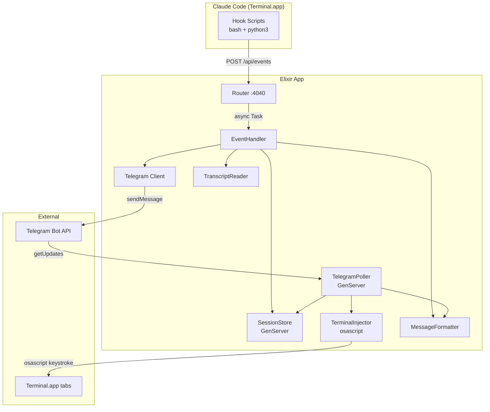
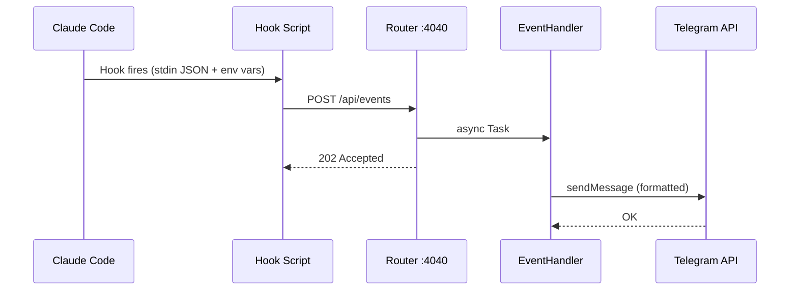
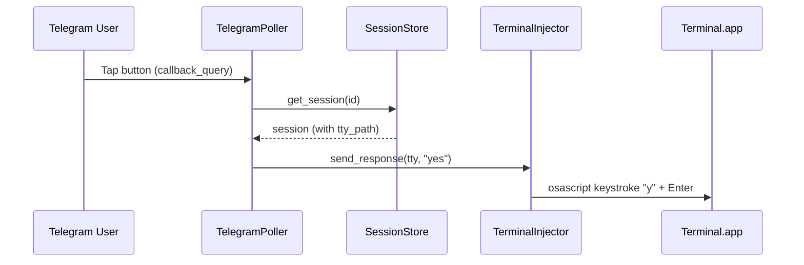

# Codebase Map

> Auto-generated by Cartographer. Last mapped: 2026-02-12

## System Overview



## Directory Structure

```
claude_notify/
├── config/
│   ├── config.exs          # Base config (port, telegram base URL)
│   ├── dev.exs              # Dev logger level
│   ├── runtime.exs          # Env vars via Dotenvy
│   └── test.exs             # Test mocks (fake telegram, port 4041)
├── hooks/
│   ├── claude-notify-prompt.sh   # UserPromptSubmit hook
│   ├── claude-notify-stop.sh     # Stop hook
│   ├── claude-notify-notify.sh   # Notification hook
│   └── claude-notify-tool.sh     # PostToolUse hook
├── lib/claude_notify/
│   ├── application.ex       # OTP supervisor tree
│   ├── router.ex            # Plug HTTP endpoints
│   ├── event_handler.ex     # Event dispatcher + orchestrator
│   ├── session_store.ex     # GenServer session state
│   ├── telegram.ex          # Telegram Bot API client
│   ├── telegram_poller.ex   # Long polling for buttons/commands
│   ├── terminal_injector.ex # AppleScript keystroke injection
│   ├── message_formatter.ex # MarkdownV2 message formatting
│   └── transcript_reader.ex # JSONL transcript parsing
├── test/claude_notify/
│   ├── event_handler_test.exs
│   ├── message_formatter_test.exs
│   ├── router_test.exs
│   └── session_store_test.exs
├── setup.sh                 # One-command setup + LaunchAgent
├── .env.example             # Template for secrets
└── mix.exs                  # Deps: bandit, plug, jason, req, dotenvy
```

## Module Guide

### Router
**Purpose**: HTTP server receiving Claude Code hook events
**Entry point**: `lib/claude_notify/router.ex`
**Endpoints**: `POST /api/events`, `GET /health`, `GET /debug/sessions`
**Dependencies**: EventHandler, SessionStore
**Note**: Events processed async via `Task.start/1`, always returns 202

### EventHandler
**Purpose**: Dispatches events to session store and Telegram
**Entry point**: `lib/claude_notify/event_handler.ex`
**Events**: `prompt`, `stop`, `tool_use`, `notification`
**Dependencies**: SessionStore, Telegram, MessageFormatter, TranscriptReader
**Note**: Auto-detects multi-choice vs yes/no from notification message content

### SessionStore
**Purpose**: In-memory GenServer tracking active sessions
**Entry point**: `lib/claude_notify/session_store.ex`
**API**: `register_prompt/4`, `register_stop/2`, `get_session/1`, `all_sessions/0`
**Note**: Auto-cleanup after 2h idle, stores TTY path for terminal injection

### Telegram
**Purpose**: Telegram Bot API client (send messages, inline keyboards, long polling)
**Entry point**: `lib/claude_notify/telegram.ex`
**API**: `send_message/1`, `send_with_buttons/2`, `get_updates/2`
**Note**: `receive_timeout` set to poll timeout + 5s to prevent early client timeout

### TelegramPoller
**Purpose**: Long polls Telegram for button presses, commands, and text input
**Entry point**: `lib/claude_notify/telegram_poller.ex`
**Commands**: `/sessions`, `/help`, text injection into selected session
**Callback data**: `select:ID`, `ID:yes`, `ID:opt_N`
**Note**: Maintains per-chat session selection state, filters "unknown" sessions

### TerminalInjector
**Purpose**: Injects keystrokes into Terminal.app via AppleScript
**Entry point**: `lib/claude_notify/terminal_injector.ex`
**API**: `send_response/2` (yes/no/esc/opt), `send_text/2` (arbitrary text)
**Note**: macOS only, requires Accessibility permissions, finds tab by TTY path

### MessageFormatter
**Purpose**: MarkdownV2 message formatting with context-aware escaping
**Entry point**: `lib/claude_notify/message_formatter.ex`
**Escaping**: `escape/1` (plain text), `escape_code/1` (code spans), `escape_pre/1` (pre blocks)
**Note**: Assistant responses wrapped in pre blocks, tool uses have emoji icons

### TranscriptReader
**Purpose**: Extracts last assistant message from Claude Code JSONL transcripts
**Entry point**: `lib/claude_notify/transcript_reader.ex`
**API**: `last_assistant_message/1`
**Note**: Searches in reverse for efficiency, handles array and string content

## Data Flow

### Outbound: Claude Code to Telegram



### Inbound: Telegram Button to Terminal



## Conventions

- **MarkdownV2 escaping**: Three contexts with different rules (plain, code, pre)
- **Session ID display**: First 8 characters used as short identifier
- **Event payloads**: All hooks send JSON with `event`, `session_id`, `tty_path`
- **TTY detection**: `ps -o tty= -p $PPID` with regex validation `^ttys[0-9]+$`
- **Error handling**: Log and continue, never crash the poller or event handler
- **Throttling**: Session updates only every 10 prompts

## Gotchas

- **Accessibility permissions**: osascript needs permission to send keystrokes via System Events
- **Three escape functions**: Wrong escaping = Telegram API rejects the message
- **LaunchAgent context**: No shell env, needs explicit PATH and HOME in run.sh
- **Port conflicts**: Kill old BEAM processes before LaunchAgent can start
- **"unknown" sessions**: Created when hooks lack session_id, filtered from /sessions list
- **Telegram callback_data**: Max 64 bytes, format is `session_id:response`
- **Long polling timeout**: Req receive_timeout must exceed Telegram's poll timeout

## Navigation Guide

**To add a new event type**: Add hook script in `hooks/`, handle in `EventHandler`, format in `MessageFormatter`
**To add a new Telegram command**: Add clause in `TelegramPoller.handle_message/2`
**To add a new button response**: Add to `@response_keys` in `TerminalInjector`, label in `TelegramPoller.response_label/1`
**To change message formatting**: Edit `MessageFormatter` (mind the escaping context)
**To modify session state**: Update `SessionStore` struct and `register_prompt/4`
