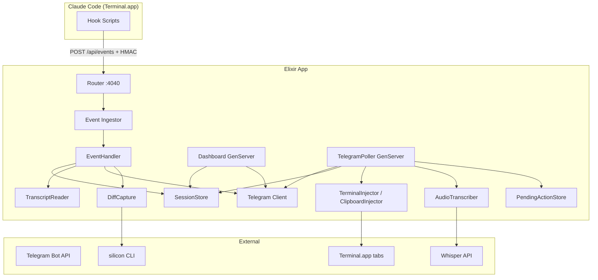

# RFC-001: Telegram Control Plane for Claude Code

- **Status**: Draft
- **Author**: Iago Cavalcante
- **Date**: 2026-02-12
- **Last Updated**: 2026-02-13
- **Project**: claude_notify

## Summary

Transform claude_notify from a notification relay into a full Telegram control plane for Claude Code. Users should be able to manage active sessions, send prompts (text and voice), view code change context, and interact with Claude Code from Telegram without returning to the terminal.

## Goals

- Provide reliable session visibility and switching from Telegram.
- Make remote prompting safe, explicit, and resilient.
- Improve mobile UX with voice-to-prompt.
- Add secure-by-default controls for all inbound and outbound surfaces.

## Non-Goals

- Real-time terminal streaming.
- Multi-user chat orchestration in the first release.
- Replacing Telegram with a web app in this RFC.

## Failure Modes This RFC Must Handle

- Unauthorized Telegram chats sending commands or button callbacks.
- Unauthenticated or replayed requests to `POST /api/events`.
- Dashboard edit failures (`message not found`, 429 rate limit, payload too long).
- Session metrics drift (prompt count inflated by non-prompt events).
- Non-text Telegram messages being injected as empty terminal input.
- Voice confirmation callbacks lost after app restart.
- Callback payload overflow (`callback_data` max 64 bytes).
- Option lists larger than supported key injection range (`1..9`).

## Proposed Features

### Feature 1: Session Dashboard

A persistent dashboard message showing active Claude Code sessions.

**Behavior**:
- `/dashboard` creates or recreates a pinned dashboard message.
- Each session shows: project, prompt count, duration, status, last activity.
- Session rows include a quick `Select` action.
- Manual `Refresh` button forces immediate update.
- Dashboard shows `Last updated` timestamp and marks stale state when refresh fails.

**Reliability requirements**:
- Use event-driven updates with coalescing and rate limiting (max 1 edit per 5s).
- If `editMessageText` returns `message to edit not found`, create a new dashboard message and repin it.
- If Telegram returns 429, respect `retry_after`, then retry with jitter.
- If formatted text exceeds Telegram limits, paginate sessions and show first page with navigation controls.
- Keep deterministic ordering: waiting sessions first, then active, then idle, each by `last_activity` desc.

**Data model additions to SessionStore**:
```elixir
%{
  status: :active | :waiting_input | :idle,
  last_tool: "Read",
  current_prompt: "...",
  files_changed: ["lib/foo.ex"],
  last_activity: 1_708_000_000
}
```

**New module**: `ClaudeNotify.Dashboard`
- Stores `dashboard_message_id` per chat.
- Reconciles dashboard lifecycle (create/edit/recreate).
- Accepts debounced session-change events.

### Feature 2: Full Conversational Prompt Interface

Send prompts to Claude Code as if typing in Terminal.app, but with explicit target/session feedback.

**Behavior**:
- After selecting a session via `/dashboard`, `/select`, or `/switch`, user text is injected to that session.
- If only one active session exists, auto-select it and confirm target.
- `/cancel` sends Escape to the selected session.
- `/approve` is shorthand for `yes`.
- Delivery confirmation always includes target short session ID and prompt preview.

**UX safety rules**:
- Ignore non-text/non-voice messages and reply with usage guidance.
- Reject empty or whitespace-only prompts.
- If selected session no longer exists, clear selection and ask for reselection.

**Multi-line prompt injection**:
Replace per-character keystroke injection with clipboard paste for long prompts, while preserving user clipboard contents.

```applescript
set oldClipboard to the clipboard
set the clipboard to theText
-- activate target Terminal tab
-- paste and press return
set the clipboard to oldClipboard
```

**Data consistency requirement**:
- Add metadata update API to avoid prompt counter drift:
```elixir
SessionStore.update_session_metadata(session_id, %{status: :waiting_input, last_tool: "Edit"})
```
- `prompt_count` increments only on real prompt events.

### Feature 3: Code Change Screenshots

Capture diff context and send visual summaries to Telegram.

**Approach A: Terminal screenshot** (simple, macOS-specific)
- Capture active Terminal window and send via `sendPhoto`.

**Approach B: Rendered diff image** (recommended)
- Generate diff from git and render as image using local tooling.
- Send image with caption including session/project context.

**Corrected CLI example (file-based render)**:
```bash
git diff --unified=5 -- lib/foo.ex > /tmp/claude_diff.patch
silicon /tmp/claude_diff.patch --language diff --theme Dracula --output /tmp/diff.png
```

**Failure handling**:
- If renderer is unavailable or fails, send a truncated text diff fallback.
- Delete temporary files immediately after send attempt.
- Rate-limit screenshots per session/file to avoid spam.

**Configuration**:
```elixir
config :claude_notify,
  screenshot_mode: :diff_image,  # :diff_image | :terminal_capture | :disabled
  diff_tool: "silicon",
  screenshot_tools: ["Edit", "Write"]
```

### Feature 4: Voice-to-Prompt via Audio Messages

Accept Telegram voice messages, transcribe, preview, and inject into a selected session.

**Flow**:
```
User sends voice message
  -> TelegramPoller validates chat_id
  -> send "Transcribing..." status message
  -> download Telegram voice file
  -> transcribe (OpenAI Whisper or local whisper.cpp)
  -> show transcription preview with [Send] [Cancel]
  -> on Send, inject into selected session
```

**State durability requirements**:
- Store pending transcriptions with TTL (default 10 minutes).
- Persist pending confirmations across process restart (disk-backed cache or persisted store).
- Expired callbacks must return a clear message: `This voice draft expired. Send a new audio message.`

**Configuration**:
```elixir
config :claude_notify,
  audio_transcription: :openai_whisper,  # :openai_whisper | :local_whisper | :disabled
  openai_api_key: System.get_env("OPENAI_API_KEY"),
  whisper_model: "whisper-1",
  whisper_language: "en",
  voice_pending_ttl_seconds: 600
```

### Feature 5: Inline Session Switching

Quick-switch sessions without full `/sessions` flow.

**Behavior**:
- `/s` and `/switch` show compact session selector.
- Reply-to session messages can infer target session.
- Status prefix per session row: `(working)`, `(waiting)`, `(idle)`.

**Protocol constraints**:
- Do not embed full session IDs in callback payloads when near limit.
- Use compact callback tokens mapped server-side to full session IDs.
- For numbered approval menus, support direct keys `1..9` only; paginate options when more than 9.

## Architecture Changes

### Updated System Diagram



### New Modules

| Module | Purpose |
|--------|---------|
| `ClaudeNotify.Dashboard` | Auto-updating and self-healing dashboard message |
| `ClaudeNotify.AudioTranscriber` | Voice file download + transcription |
| `ClaudeNotify.DiffCapture` | Diff image generation and fallback handling |
| `ClaudeNotify.ClipboardInjector` | Safe multiline injection with clipboard restore |
| `ClaudeNotify.PendingActionStore` | Durable pending voice/action confirmations |
| `ClaudeNotify.EventIngestor` | Bounded event processing and backpressure |

### New Dependencies

```elixir
# mix.exs
defp deps do
  [
    # ...existing deps...
    {:multipart, "~> 0.4"}
  ]
end
```

**System dependencies**:
- `silicon` (optional): `cargo install silicon`
- `whisper.cpp` (optional): `brew install whisper-cpp`
- OpenAI API key if using cloud Whisper

### New Environment Variables

```bash
# .env additions
CLAUDE_NOTIFY_WEBHOOK_SECRET=... # HMAC secret for /api/events
OPENAI_API_KEY=sk-...             # optional
AUDIO_BACKEND=openai_whisper      # openai_whisper | local_whisper | disabled
SCREENSHOT_MODE=diff_image        # diff_image | terminal_capture | disabled
DASHBOARD_AUTO_UPDATE=true
ENABLE_DEBUG_ENDPOINTS=false
MAX_EVENT_CONCURRENCY=8
VOICE_PENDING_TTL_SECONDS=600
```

## Implementation Phases

### Phase 0: Security and Reliability Gate (Priority: Critical)

**Must be completed before Phase 1 feature rollout.**

- Enforce `chat_id` validation on all incoming Telegram `message` and `callback_query` paths.
- Add HMAC signature validation to `/api/events` with timestamp window and replay protection.
- Remove `/debug/sessions` from production, or protect behind explicit debug config.
- Sanitize and constrain `transcript_path` to allowed roots.
- Replace unbounded `Task.start` event handling with bounded concurrency worker strategy.
- Harden terminal injection path (clipboard-based input, no user text interpolation in AppleScript).
- Add automated tests covering unauthorized chat attempts, invalid signatures, replayed requests, and path traversal attempts.

**Estimated effort**: 2-3 sessions

### Phase 1: Session Dashboard (Priority: High)

- Implement `Dashboard` GenServer and `/dashboard` command.
- Add stale/retry/recreate behavior for dashboard updates.
- Add compact `Refresh` action and deterministic session ordering.
- Add auto-select behavior when exactly one active session exists.

**Estimated effort**: 2-3 sessions

### Phase 2: Enhanced Prompt Interface (Priority: High)

- Implement `ClipboardInjector` with clipboard restore.
- Add `/cancel` and `/approve` shortcuts.
- Add non-text guards and empty-input guards.
- Add target-session confirmation and improved delivery receipts.
- Add metadata-only session updates so prompt metrics stay accurate.

**Estimated effort**: 1-2 sessions

### Phase 3: Code Change Screenshots (Priority: Medium)

- Implement `DiffCapture` with `silicon` integration.
- Add `send_photo` in Telegram module.
- Add text fallback path for renderer failures.
- Add cleanup and per-session rate limiting.

**Estimated effort**: 2-3 sessions

### Phase 4: Voice-to-Prompt (Priority: Medium)

- Implement `AudioTranscriber` backends.
- Add transcribing status message and preview confirmation flow.
- Add durable `PendingActionStore` with TTL.
- Handle expired callbacks with clear user feedback.

**Estimated effort**: 2-3 sessions

### Phase 5: Inline Session Switching and Polish (Priority: Medium)

- Add `/switch` and reply-based targeting.
- Implement compact callback token mapping.
- Add >9 option pagination for approval prompts.
- Add UX polish for status labels and message threading.

**Estimated effort**: 1-2 sessions

## Security Considerations

- **Chat authorization**: inbound Telegram updates must match configured owner chat ID before any action.
- **Event auth**: `/api/events` must verify HMAC signature and reject stale/replayed payloads.
- **Path safety**: reject unsafe `transcript_path` values (`..`, symlink escape, or outside allowed roots).
- **Sensitive artifacts**: screenshots/audio stored under `/tmp` only, with immediate post-send deletion.
- **Injection safety**: user text is never interpolated into executable AppleScript source.

## Open Questions

1. **Whisper backend**: default to OpenAI API for simplicity or local whisper.cpp for offline use?
2. **Screenshot backend**: local-only (`silicon`) vs optional cloud renderer fallback?
3. **Session history retention**: should stopped session history be persisted to disk?
4. **Multi-user roadmap**: remain single-user in v1 or design data model for multi-chat now?

## Rejected Alternatives

- **Telegram Bot Webhooks**: requires public ingress/tunnel; long polling is simpler for local-first operation.
- **Web dashboard**: adds hosting/frontend complexity; Telegram already covers desktop and mobile.
- **Full terminal streaming**: noisy, rate-limit heavy, and poor mobile UX.
- **Telegram Mini App**: richer UI but out-of-scope for initial control-plane rollout.

## Success Metrics

- User can manage sessions from Telegram without terminal switching.
- Unauthorized Telegram chats trigger zero successful actions.
- Invalid/replayed `/api/events` requests trigger zero successful actions.
- Dashboard recovers from deletion within 10 seconds.
- Voice prompts are transcribed and injected within 3 seconds (p50).
- Diff screenshots (or fallback text) arrive within 2 seconds after edit events (p50).
- Prompt count matches real prompt submissions (no inflation from metadata updates).
